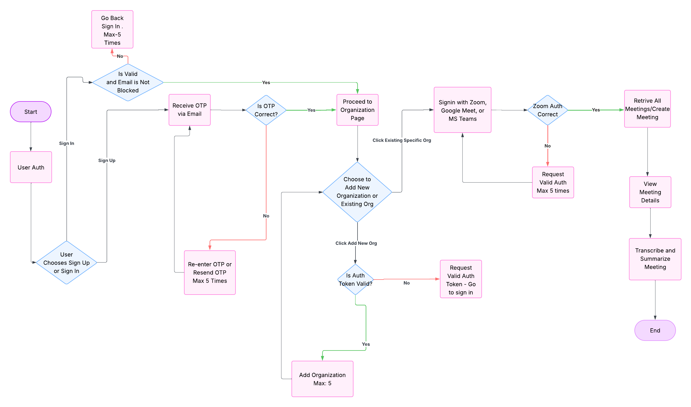

# 📝 NGI Transcribe App - Frontend

Welcome to the **NGI Transcribe App Frontend**, a Next.js-based web application for transcribing and managing meeting conversations with an intuitive UI.

> This is the frontend of the **Advanced Meeting Intelligence System**, designed to seamlessly interact with the backend API and provide real-time meeting transcription, analysis, and management tools.

---

## 🚀 Tech Stack

- **Framework**: [Next.js](https://nextjs.org/)
- **Language**: JavaScript (Next JS, React)
- **State Management**: Redux Toolkit, Redux Persist
- **Styling**: Tailwind CSS

---

## 📁 Folder Structure (Simplified)


## 🛠️ Getting Started

### Prerequisites

- Node.js v16 or higher
- npm or yarn

### Installation


# Clone the repo
git clone https://github.com/ayanchyaziz123/ngi-transcribe-app-frontend.git
cd ngi-transcribe-app-frontend

## Getting Started

```bash
# Install dependencies
npm install
# or
yarn install

# Running the Development Server
npm run dev
# or
yarn dev    
```

## ✨ Features

### 🤖 AI-Powered Capabilities

- 🔊 **Real-time Meeting Transcription**  
  Retrieve and transcribe live or recorded meetings using AI-powered speech recognition with support for **Zoom**, **Google Meet**, and **Microsoft Teams**.

- 🧠 **Smart Summarization**  
  Automatically generate intelligent summaries of meetings, extracting key points, decisions, and action items.

- 🗣️ **Speaker Identification (Planned)**  
  AI-driven diarization to identify and label individual speakers.

- 🧠 **Context-Aware Highlights (Planned)**  
  Automatically detect and highlight critical parts of a meeting using semantic analysis.

---

### 🧩 UI & UX Features

- 🗂️ **Multi-Step Form Workflow**  
  Easily manage and edit transcription records through a guided, step-by-step interface.

- 🔍 **Meeting Retrieval from Major Platforms**  
  Connect your Zoom, Google Meet, or MS Teams accounts to securely fetch and sync past meetings for processing.

- 📅 **Pagination, Filtering & Sorting**  
  Navigate and organize your transcriptions with advanced filters by date, speaker, or platform.

- 🔐 **Google Authentication**  
  Log in securely using Google

- 🎨 **Modern UI & Animations**  
  Built with Tailwind CSS and Framer Motion for sleek transitions, responsiveness, and a great user experience.


## 📁 Flow Chart




